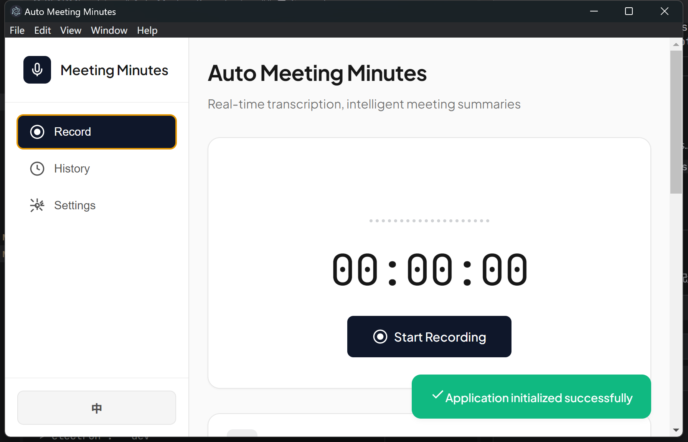

# Auto Meeting Recorder

<p align="center">
  
  
  
  
  
</p>

<p align="center">
  
  
</p>

<p align="center">
  <b>🎙️ Record · 📝 Transcribe · 🤖 Summarize</b>
</p>

<p align="center">
  A cross-platform desktop application for automatic meeting minutes generation with AI-powered transcription and summarization.
</p>

<p align="center">
  <a href="README_CN.md">中文文档</a> •
  <a href="#features">Features</a> •
  <a href="#installation">Installation</a> •
  <a href="#usage">Usage</a> •
  <a href="#screenshots">Screenshots</a>
</p>

---

## ✨ Features

<table>
<tr>
<td width="50%">

### 🎙️ **Audio Recording**
- Record meeting audio with microphone and system audio support
- Real-time audio visualization with animated waveform
- Pause and resume recording at any time
- High-quality audio capture in WebM format
- Upload and process existing audio files

</td>
<td width="50%">

### 📝 **Speech-to-Text**
- Transcribe audio using OpenAI-compatible APIs
- Support for multiple providers (SiliconFlow, OpenAI, Alibaba Cloud)
- Real-time transcription display
- Multi-language support
- Test API connectivity before recording

</td>
</tr>
<tr>
<td width="50%">

### 🤖 **AI Summary Generation**
- Automatically generate meeting minutes using LLM APIs
- Customizable templates with Markdown support
- Structured output (overview, topics, decisions, action items)
- Support for DeepSeek, GPT-4, Claude, and other models
- Regenerate summary with one click

</td>
<td width="50%">

### 🔒 **Privacy-First**
- All data stored locally on your device
- No cloud dependency for core functionality
- No analytics or telemetry
- Your API keys stay on your device
- Encrypted storage for sensitive settings

</td>
</tr>
<tr>
<td width="50%">

### 📚 **History Management**
- Save and manage all meeting records
- View detailed meeting information
- Copy transcript and summary to clipboard
- Export audio files from past meetings
- Delete old records to free up space

</td>
<td width="50%">

### 💻 **Cross-Platform**
- Windows, macOS, and Linux support
- Desktop app built with Electron
- Web version for browser use
- Consistent experience across platforms
- Automatic platform detection

</td>
</tr>
<tr>
<td width="50%">

### 🎨 **Modern UI**
- Clean and intuitive interface design
- Tab-based navigation for content switching
- Responsive layout adapts to window size
- Real-time recording timer and visualizer
- Toast notifications for user feedback

</td>
<td width="50%">

### 🌐 **Internationalization**
- Multi-language support (English, Chinese)
- Easy to add more languages
- Language auto-detection
- Localized UI elements and messages

</td>
</tr>
</table>

---

## 📸 Screenshots

### 🎙️ Recording Interface
<p align="center">
  
</p>
<p align="center"><i>Main recording interface with audio visualization and timer</i></p>

<!-- 
### 📝 Transcription View


### 📊 Meeting Minutes


### ⚙️ Settings Page

-->

---

## 🚀 Quick Start

### Prerequisites

- **Node.js 16+** (for development)
- **Modern browser** (Chrome, Firefox, Edge) for web version
- **API keys** for speech recognition and summary generation

### Installation

#### Option 1: Desktop App (Recommended)

**Download Pre-built Binaries**

| Platform | Download |
|----------|----------|
| Windows | [AutoMeetingRecorder-2.6.1-win.exe](https://github.com/lester2pastm/auto-meeting-recorder/releases) |
| macOS | [AutoMeetingRecorder-2.6.1-mac.dmg](https://github.com/lester2pastm/auto-meeting-recorder/releases) |
| Linux | [AutoMeetingRecorder-2.6.1-linux.AppImage](https://github.com/lester2pastm/auto-meeting-recorder/releases) |

**Build from Source**

```bash
# Clone the repository
git clone https://github.com/lester2pastm/auto-meeting-recorder.git
cd auto-meeting-recorder

# Install dependencies
npm install

# Run in development mode
npm run dev

# Build for production
npm run build        # All platforms
npm run build:win    # Windows only
npm run build:mac    # macOS only
npm run build:linux  # Linux only
```

#### Option 2: Web Version

Simply open `src/index.html` in your browser or serve it with any static file server:

```bash
npx serve src
```

---

## ⚙️ Configuration

### API Setup

The app requires API keys for speech recognition and meeting summary generation.

#### Recommended: Speech-to-Text API

| Provider | API URL | Model |
|----------|---------|-------|
| **SiliconFlow** | `https://api.siliconflow.cn/v1/audio/transcriptions` | `TeleAI/TeleSpeechASR` |
| OpenAI | `https://api.openai.com/v1/audio/transcriptions` | `whisper-1` |
| Alibaba Cloud | `https://dashscope.aliyuncs.com/api/v1/audio/transcriptions` | `whisper-v3` |

#### Recommended: Summary Generation API

| Provider | API URL | Model |
|----------|---------|-------|
| **DeepSeek** | `https://api.deepseek.com/v1/chat/completions` | `deepseek-chat` |
| OpenAI | `https://api.openai.com/v1/chat/completions` | `gpt-4`, `gpt-3.5-turbo` |
| Anthropic | `https://api.anthropic.com/v1/messages` | `claude-3-opus`, `claude-3-sonnet` |
| Alibaba Cloud | `https://dashscope.aliyuncs.com/api/v1/services/aigc/text-generation/generation` | `qwen-max`, `qwen-plus` |

### Meeting Minutes Template

Customize your meeting minutes template using Markdown:

```markdown
# Meeting Minutes - {{date}}

## Overview
- **Date:** {{date}}
- **Duration:** {{duration}}
- **Participants:** {{participants}}

## Main Topics
{{topics}}

## Discussion Points
{{discussion}}

## Decisions
{{decisions}}

## Action Items
{{action_items}}

## Other Notes
{{notes}}
```

---

## 📖 Usage Guide

### First Time Setup

1. Open the app and navigate to **Settings**
2. Configure your Speech-to-Text API credentials (SiliconFlow recommended)
3. Configure your Summary Generation API credentials (DeepSeek recommended)
4. Customize your meeting template (optional)
5. Test both API configurations

### Recording a Meeting

1. Click **"Start Recording"** to begin capturing audio
2. Use the **Pause** button during breaks
3. Click **"Stop Recording"** when the meeting ends
4. Wait for transcription and summary generation
5. Switch between **Meeting Transcript** and **Meeting Minutes** tabs
6. Copy content to clipboard or export as needed

### Managing History

- Access all past meetings in the **History** page
- View detailed meeting information including audio playback
- Copy transcript or summary from any past meeting
- Export audio files from previous recordings
- Delete old records to free up space

### Uploading Audio Files

You can also upload existing audio files instead of recording:

1. Click the **Upload** button in the transcript tab
2. Select an audio file (supports common formats)
3. Wait for transcription and summary generation

---

## 🏗️ Project Structure

```
auto-meeting-recorder/
├── 📁 electron/              # Electron main process
│   ├── main.js              # Main entry point
│   └── preload.js           # Preload script for security
│
├── 📁 src/                   # Application source code
│   ├── 📁 css/              # Stylesheets
│   │   └── style.css        # Main stylesheet
│   ├── 📁 js/               # JavaScript modules
│   │   ├── app.js           # Main application logic
│   │   ├── api.js           # API integrations (STT & LLM)
│   │   ├── recorder.js      # Audio recording functionality
│   │   ├── storage.js       # Data persistence (IndexedDB/FileSystem)
│   │   ├── ui.js            # UI interactions and rendering
│   │   └── i18n.js          # Internationalization
│   └── index.html           # Main HTML file
│
├── 📁 docs/                  # Documentation
│   └── 📁 plans/            # Development plans
│
├── 📁 .github/               # GitHub configurations
│   └── 📁 workflows/        # CI/CD workflows
│
├── package.json             # Project configuration
├── LICENSE                  # MIT License
└── README.md                # This file
```

---

## 🌐 Browser Compatibility

| Browser | Minimum Version | Status |
|---------|----------------|--------|
| Chrome | 90+ | ✅ Fully Supported |
| Firefox | 88+ | ✅ Fully Supported |
| Edge | 90+ | ✅ Fully Supported |
| Safari | 14+ | ⚠️ Limited Support |

---

## 💾 Data Storage

All data is stored locally on your device:

| Data Type | Desktop | Web |
|-----------|---------|-----|
| Audio Recordings | Local filesystem | IndexedDB |
| Transcriptions | Electron Store | IndexedDB |
| Meeting Minutes | Electron Store | IndexedDB |
| API Settings | Encrypted store | LocalStorage |

---

## 🔐 Privacy & Security

- ✅ All data stored locally on your device
- ✅ API keys are never shared or transmitted except to your configured endpoints
- ✅ No analytics, telemetry, or tracking
- ✅ No cloud services required
- ✅ Open source - audit the code yourself

---

## 🤝 Contributing

We welcome contributions! Please follow these steps:

1. **Fork** the repository
2. **Create** your feature branch: `git checkout -b feature/AmazingFeature`
3. **Commit** your changes: `git commit -m 'Add some AmazingFeature'`
4. **Push** to the branch: `git push origin feature/AmazingFeature`
5. **Open** a Pull Request

Please read our [Contributing Guide](CONTRIBUTING.md) for more details.

### Contributors

<a href="https://github.com/lester2pastm/auto-meeting-recorder/graphs/contributors">
  
</a>

---

## 📜 License

This project is licensed under the **MIT License** - see the [LICENSE](LICENSE) file for details.

---

## 🙏 Acknowledgments

- Built with [Electron](https://www.electronjs.org/) - Cross-platform desktop apps
- Speech recognition powered by [OpenAI Whisper](https://openai.com/research/whisper) and compatible APIs
- Meeting summaries generated by Large Language Models
- Icons by [Heroicons](https://heroicons.com/)

---

## 💬 Support

<p align="center">
  <b>If you find this project helpful, please give it a ⭐ on GitHub!</b>
</p>

<p align="center">
  <a href="https://github.com/lester2pastm/auto-meeting-recorder/issues">🐛 Report Bug</a> •
  <a href="https://github.com/lester2pastm/auto-meeting-recorder/issues">✨ Request Feature</a> •
  <a href="https://github.com/lester2pastm/auto-meeting-recorder/discussions">💬 Discussions</a>
</p>

---

<p align="center">
  Made with ❤️ by <a href="https://github.com/lester2pastm">Lester</a>
</p>
