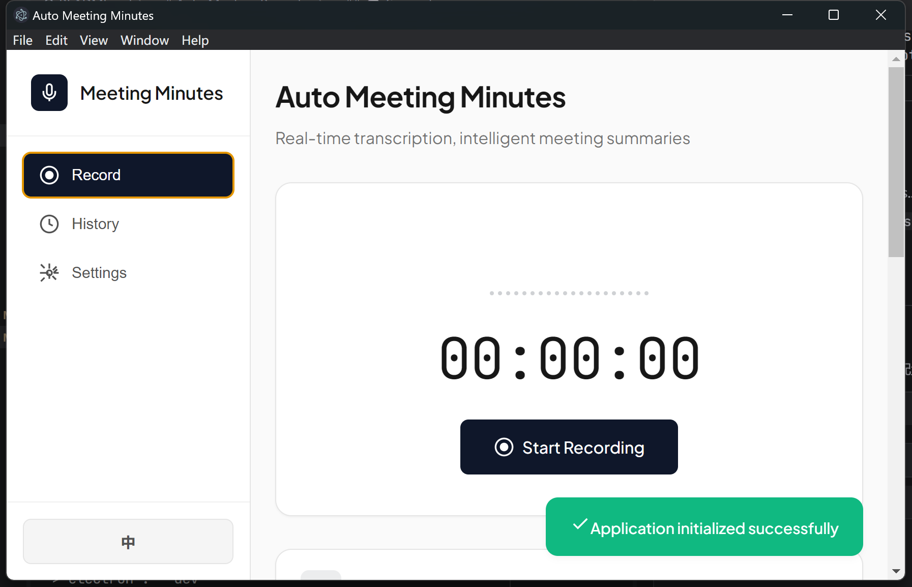

# 自动会议纪要

<p align="center">
  
  
  
  
  
</p>

<p align="center">
  
  
</p>

<p align="center">
  <b>🎙️ 录音 · 📝 转写 · 🤖 总结</b>
</p>

<p align="center">
  一款跨平台的桌面应用程序，利用 AI 技术实现语音转文字和智能会议纪要生成。
</p>

<p align="center">
  <a href="README.md">English</a> •
  <a href="#功能特性">功能特性</a> •
  <a href="#安装">安装</a> •
  <a href="#使用指南">使用指南</a> •
  <a href="#截图">截图</a>
</p>

---

## ✨ 功能特性

<table>
<tr>
<td width="50%">

### 🎙️ **音频录制**
- 支持麦克风和系统音频录制
- 实时音频可视化效果，动态波形展示
- 暂停和继续录制功能
- WebM 格式高质量音频采集
- 支持上传现有音频文件进行转写

</td>
<td width="50%">

### 📝 **语音转文字**
- 基于 OpenAI 兼容 API 的语音转录
- 支持多家服务商（SiliconFlow、OpenAI、阿里云）
- 实时转录文本显示
- 多语言支持
- 录音前可测试 API 连通性

</td>
</tr>
<tr>
<td width="50%">

### 🤖 **AI 智能总结**
- 使用大语言模型 API 自动生成会议纪要
- 支持 Markdown 自定义模板
- 结构化输出（会议概述、议题、决策、待办事项）
- 支持 DeepSeek、GPT-4、Claude 等主流模型
- 一键重新生成会议纪要

</td>
<td width="50%">

### 🔒 **隐私优先**
- 所有数据本地存储
- 核心功能无需依赖云服务
- 无分析统计和遥测
- API 密钥仅保存在本地设备
- 敏感设置加密存储

</td>
</tr>
<tr>
<td width="50%">

### 📚 **历史记录管理**
- 保存和管理所有会议记录
- 查看详细的会议信息
- 复制转录文本和纪要到剪贴板
- 从历史记录导出音频文件
- 删除旧记录释放存储空间

</td>
<td width="50%">

### 💻 **跨平台支持**
- 支持 Windows、macOS 和 Linux
- 基于 Electron 的桌面应用
- 浏览器网页版本
- 各平台体验一致
- 自动检测运行平台

</td>
</tr>
<tr>
<td width="50%">

### 🎨 **现代化界面**
- 简洁直观的界面设计
- 标签页式内容切换导航
- 响应式布局，自适应窗口大小
- 实时录音计时器和可视化效果
- Toast 通知提示用户操作反馈

</td>
<td width="50%">

### 🌐 **国际化支持**
- 多语言支持（中文、英文）
- 易于添加更多语言
- 自动检测系统语言
- 界面元素和消息本地化

</td>
</tr>
</table>

---

## 📸 截图

### 🎙️ 录音界面
<p align="center">
  
</p>
<p align="center"><i>主录音界面，包含音频可视化和计时器</i></p>

<!-- 
### 📝 转写视图


### 📊 会议纪要


### ⚙️ 设置页面

-->

---

## 🚀 快速开始

### 环境要求

- **Node.js 16+**（开发环境）
- **现代浏览器**（Chrome、Firefox、Edge）用于网页版本
- **API 密钥**（语音识别和纪要生成）

### 安装

#### 方案一：桌面应用（推荐）

**下载预编译版本**

| 平台 | 下载链接 |
|------|----------|
| Windows | [AutoMeetingRecorder-2.0.0-win.exe](https://github.com/lester2pastm/auto-meeting-recorder/releases) |
| macOS | [AutoMeetingRecorder-2.0.0-mac.dmg](https://github.com/lester2pastm/auto-meeting-recorder/releases) |
| Linux | [AutoMeetingRecorder-2.0.0-linux.AppImage](https://github.com/lester2pastm/auto-meeting-recorder/releases) |

**从源码构建**

```bash
# 克隆仓库
git clone https://github.com/lester2pastm/auto-meeting-recorder.git
cd auto-meeting-recorder

# 安装依赖
npm install

# 开发模式运行
npm run dev

# 构建生产版本
npm run build        # 所有平台
npm run build:win    # 仅 Windows
npm run build:mac    # 仅 macOS
npm run build:linux  # 仅 Linux
```

#### 方案二：网页版本

直接用浏览器打开 `src/index.html` 文件，或使用静态文件服务器：

```bash
npx serve src
```

---

## ⚙️ 配置说明

### API 设置

应用需要配置 API 密钥用于语音识别和会议纪要生成。

#### 推荐：语音识别 API

| 服务商 | API 地址 | 模型 |
|--------|----------|------|
| **SiliconFlow** | `https://api.siliconflow.cn/v1/audio/transcriptions` | `TeleAI/TeleSpeechASR` |
| OpenAI | `https://api.openai.com/v1/audio/transcriptions` | `whisper-1` |
| 阿里云 | `https://dashscope.aliyuncs.com/api/v1/audio/transcriptions` | `whisper-v3` |

#### 推荐：纪要生成 API

| 服务商 | API 地址 | 模型 |
|--------|----------|------|
| **DeepSeek** | `https://api.deepseek.com/v1/chat/completions` | `deepseek-chat` |
| OpenAI | `https://api.openai.com/v1/chat/completions` | `gpt-4`, `gpt-3.5-turbo` |
| Anthropic | `https://api.anthropic.com/v1/messages` | `claude-3-opus`, `claude-3-sonnet` |
| 阿里云 | `https://dashscope.aliyuncs.com/api/v1/services/aigc/text-generation/generation` | `qwen-max`, `qwen-plus` |

### 会议纪要模板

使用 Markdown 自定义会议纪要模板：

```markdown
# 会议纪要 - {{date}}

## 会议信息
- **日期：** {{date}}
- **时长：** {{duration}}
- **参会人员：** {{participants}}

## 主要议题
{{topics}}

## 讨论要点
{{discussion}}

## 决策事项
{{decisions}}

## 待办事项
{{action_items}}

## 其他备注
{{notes}}
```

---

## 📖 使用指南

### 首次设置

1. 打开应用，进入**设置**页面
2. 配置语音识别 API 凭证（推荐使用 SiliconFlow）
3. 配置纪要生成 API 凭证（推荐使用 DeepSeek）
4. 自定义会议纪要模板（可选）
5. 测试两个 API 配置是否正常工作

### 录制会议

1. 点击**"开始录音"**开始捕获音频
2. 休息时可使用**暂停**按钮
3. 会议结束后点击**"停止录音"**
4. 等待转录和纪要生成完成
5. 在**会议全文**和**会议纪要**标签页之间切换查看
6. 复制内容到剪贴板或按需导出

### 管理历史记录

- 在**历史**页面查看所有会议记录
- 查看详细的会议信息，包括音频回放
- 从任何历史会议复制转录文本或纪要
- 从之前的录音导出音频文件
- 删除旧记录释放存储空间

### 上传音频文件

你也可以上传现有音频文件代替实时录音：

1. 在转写标签页点击**上传**按钮
2. 选择音频文件（支持常见格式）
3. 等待转录和纪要生成完成

---

## 🏗️ 项目结构

```
auto-meeting-recorder/
├── 📁 electron/              # Electron 主进程
│   ├── main.js              # 主入口
│   └── preload.js           # 预加载脚本（安全）
│
├── 📁 src/                   # 应用源代码
│   ├── 📁 css/              # 样式表
│   │   └── style.css        # 主样式文件
│   ├── 📁 js/               # JavaScript 模块
│   │   ├── app.js           # 主应用逻辑
│   │   ├── api.js           # API 集成（语音识别和大语言模型）
│   │   ├── recorder.js      # 音频录制功能
│   │   ├── storage.js       # 数据持久化（IndexedDB/文件系统）
│   │   ├── ui.js            # UI 交互和渲染
│   │   └── i18n.js          # 国际化
│   └── index.html           # 主 HTML 文件
│
├── 📁 docs/                  # 文档
│   └── 📁 plans/            # 开发计划
│
├── 📁 .github/               # GitHub 配置
│   └── 📁 workflows/        # CI/CD 工作流
│
├── package.json             # 项目配置
├── LICENSE                  # MIT 许可证
└── README_CN.md             # 本文件
```

---

## 🌐 浏览器兼容性

| 浏览器 | 最低版本 | 支持状态 |
|--------|----------|----------|
| Chrome | 90+ | ✅ 完全支持 |
| Firefox | 88+ | ✅ 完全支持 |
| Edge | 90+ | ✅ 完全支持 |
| Safari | 14+ | ⚠️ 有限支持 |

---

## 💾 数据存储

所有数据均在本地存储：

| 数据类型 | 桌面版 | 网页版 |
|----------|--------|--------|
| 录音文件 | 本地文件系统 | IndexedDB |
| 转录文本 | Electron Store | IndexedDB |
| 会议纪要 | Electron Store | IndexedDB |
| API 设置 | 加密存储 | LocalStorage |

---

## 🔐 隐私与安全

- ✅ 所有数据存储在本地设备
- ✅ API 密钥仅用于访问配置的端点，不会被共享
- ✅ 无分析统计、遥测或追踪
- ✅ 无需依赖云服务
- ✅ 开源代码，可自行审计

---

## 🤝 参与贡献

欢迎参与贡献！请按以下步骤操作：

1. **Fork** 本仓库
2. **创建** 功能分支：`git checkout -b feature/AmazingFeature`
3. **提交** 更改：`git commit -m 'Add some AmazingFeature'`
4. **推送** 到分支：`git push origin feature/AmazingFeature`
5. **创建** Pull Request

详细说明请阅读 [贡献指南](CONTRIBUTING.md)。

### 贡献者

<a href="https://github.com/lester2pastm/auto-meeting-recorder/graphs/contributors">
  
</a>

---

## 📜 许可证

本项目采用 **MIT 许可证** - 查看 [LICENSE](LICENSE) 文件了解详情。

---

## 🙏 致谢

- 基于 [Electron](https://www.electronjs.org/) 构建 - 跨平台桌面应用框架
- 语音识别由 [OpenAI Whisper](https://openai.com/research/whisper) 及兼容 API 提供支持
- 会议纪要由大语言模型生成
- 图标来自 [Heroicons](https://heroicons.com/)

---

## 💬 支持

<p align="center">
  <b>如果这个项目对你有帮助，请在 GitHub 上给它一个 ⭐！</b>
</p>

<p align="center">
  <a href="https://github.com/lester2pastm/auto-meeting-recorder/issues">🐛 报告问题</a> •
  <a href="https://github.com/lester2pastm/auto-meeting-recorder/issues">✨ 功能建议</a> •
  <a href="https://github.com/lester2pastm/auto-meeting-recorder/discussions">💬 讨论交流</a>
</p>

---

<p align="center">
  用 ❤️ 制作 by <a href="https://github.com/lester2pastm">Lester</a>
</p>
